# PILOT-BIZ-001 아트월·오브제 콘셉트

Last updated: 2026-08-11

Status: `ART WALL V2 9 IMAGES GENERATED`, 선택·출력·STL 미진행

실제 주소·좌표는 기록하지 않는다. 이 문서는 비식별화한 Site Remedy
Identity를 아트월과 제품으로 번역한 결과와 재생성 프롬프트를 보존한다.

## 1. 공통 Remedy Identity

```json
{
  "analysis_scope": "external",
  "product_identity": "Space Guardian",
  "target_element": "earth",
  "secondary_element": "wood",
  "energy_mode": "STABILIZE",
  "secondary_mode": "CIRCULATE",
  "remedy_goal": "스쳐 지나가는 골목 흐름을 밝고 안정적인 도착 경험으로 전환",
  "guardian_animal": "Korean native guardian dog",
  "placement": "gate_and_reception",
  "primary_color": "warm sand and ochre",
  "secondary_color": "muted celadon and charcoal",
  "accent": "restrained brass",
  "pose": "seated alert guardian with the tail closing a protected loop",
  "form_language": "grounded_shield_loop",
  "guardian_visibility": 80
}
```

개는 고객의 출생 띠가 아니라 공간의 문지기·환대·안정을 담당하는
`Space Guardian`이다. 아트월과 오브제는 같은 동물, 보호 고리, 오행 팔레트를
공유하되 완전히 같은 형상을 복제하지 않는다.

## 2. 생성 결과

### 아트월 v2 — 현재 후보

사용자 검토에서 v1의 개가 실제 반려견 초상처럼 보여 비방화의 신비성,
영물성, 화풍 차이를 잃었다고 판정했다. v2는 수호동물의 종을 알아볼 수 있는
단서만 남기고 몸을 매체와 공간 구조로 변환한다.

1. `Veiled Earth Spirit` — 추상 회화형. 지형을 두 번째로 볼 때 개가 드러남

   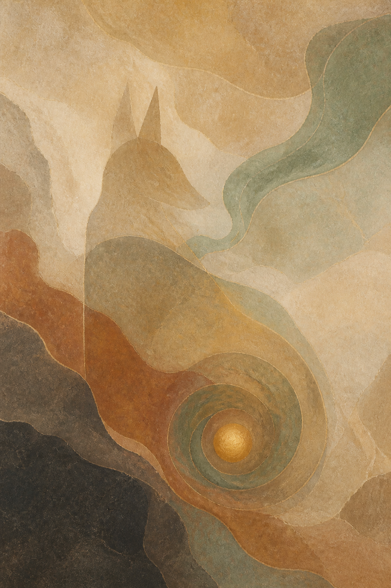

2. `Spirit of the Warm Gate` — 현대 민화·아르누보형. 식물·광물 무늬의 영물

   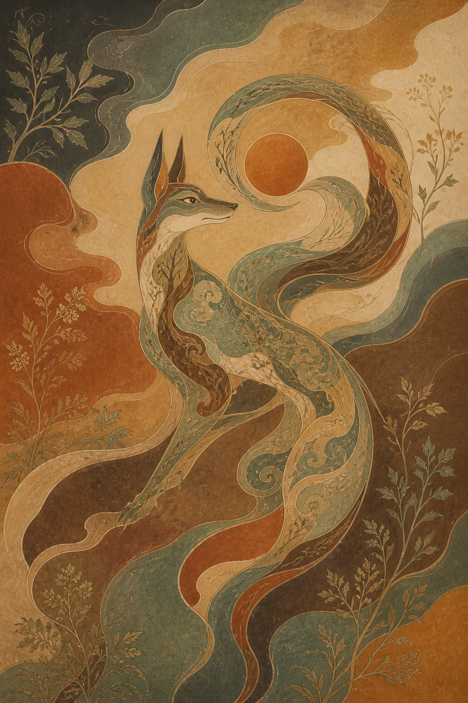

3. `Breath at the Threshold` — 수묵 여백형. 안개와 산수가 몸이 되는 영물

   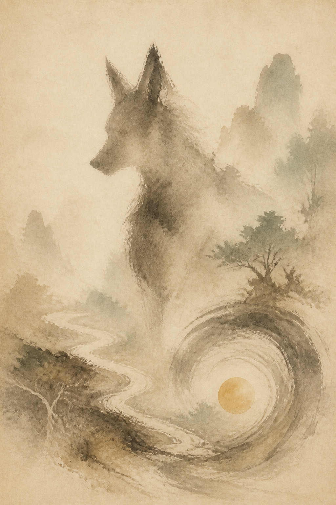

4. `Silent Sentinel Totem` — 기하 토템형. 건축적 수호 구조로 변환된 영물

   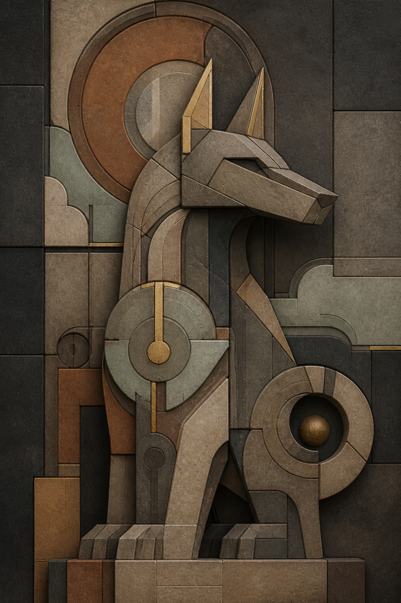

5. `The Hound Beneath the Wind` — 일본 민화·에도 목판형. 바람·소나무·물결이
   몸을 이루는 길목의 영물

   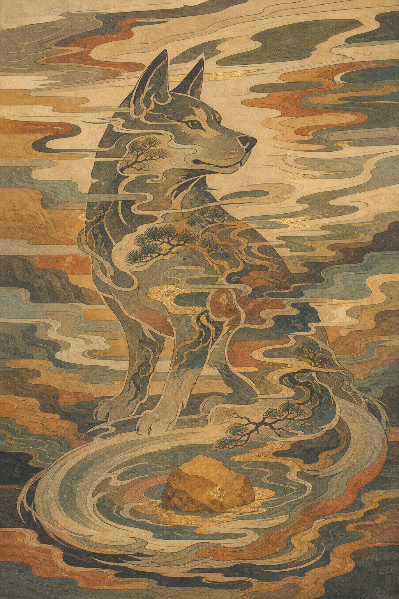

6. `The Hound of the Hidden Orchard` — 유럽 중세 태피스트리·상징주의형.
   오래된 과수원과 문턱을 지키는 성스러운 수호견

   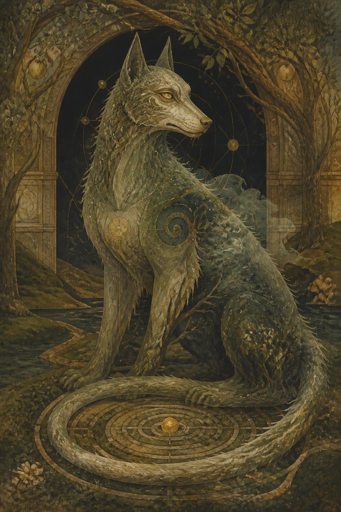

### 우키요에 세부 변형 3안

7. `Guardian of the Earthen Pass` — 낮의 산수 대경관형. 산세·소나무·물길과
   수호견이 하나의 거대한 입지 영물로 결합

   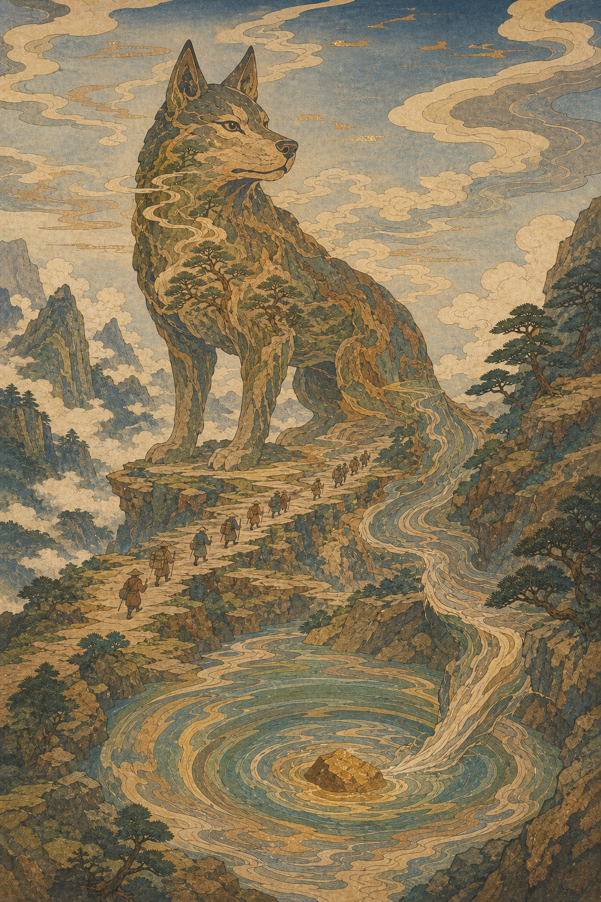

8. `Indigo Watch at the Empty Gate` — 아이즈리 야행형. 비 내리는 빈 문과
   안개를 먼저 보고 나서 수호견 형상을 발견하는 가장 미스터리한 안

   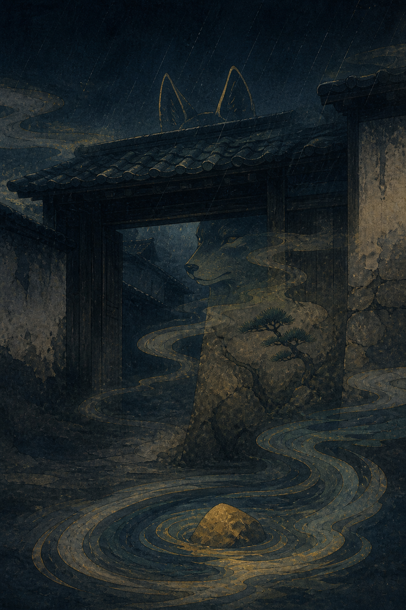

9. `The Amber Seal` — 고급 스리모노형. 빈 종이 여백, 압인, 운모와 금속성
   안료로 만든 개인 의식화 같은 수집품형

   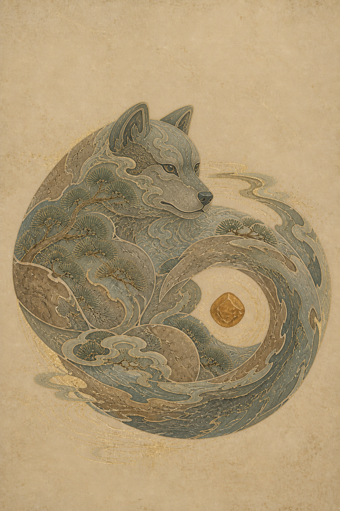

`The Amber Seal`의 최초 생성은 귀와 좁은 주둥이 때문에 여우로 읽힐 위험이
있어 폐기했다. 최종 파일은 구도·질감은 보존하고 머리 폭, 주둥이 길이와 귀
비율만 개 영물로 교정한 버전이다.

### 아트월 v1 — 폐기 후보, 실패 기록

아래 3안은 팔레트와 Remedy Identity 연결은 맞지만 털·눈·코와 실제 견종
묘사가 강해 `영물형 비방화`로 채택하지 않는다. 향후 프롬프트 회귀 비교용으로만
보존한다.

1. `Quiet Gate` — 밝은 기본형, 현대 민화 선묘와 유기적 추상

   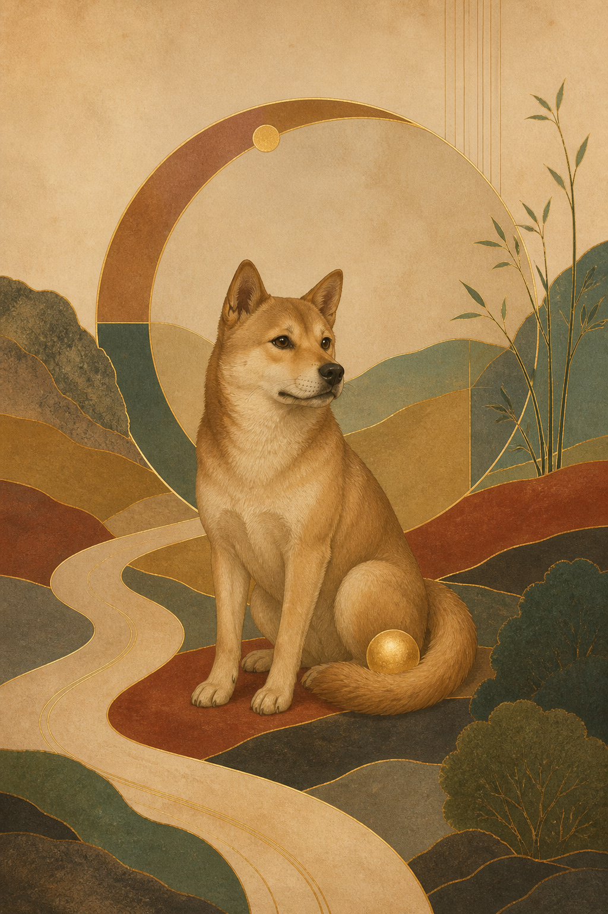

2. `Celadon Night Watch` — 어두운 부티크 로비형, 옻칠·야간 청자 흐름

   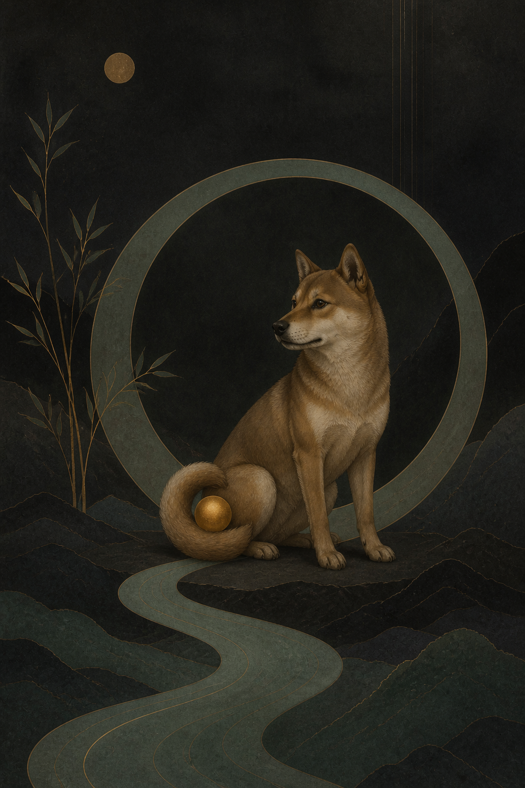

3. `Ochre Arrival` — 대담한 그래픽형, 황토 중심의 도착·정착 서사

   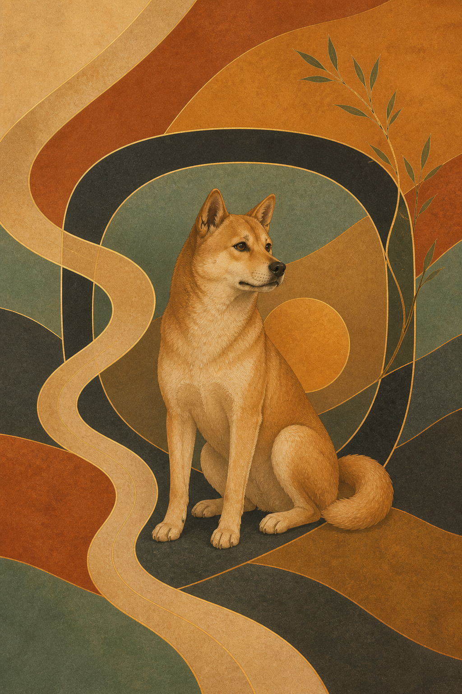

### 오브제

1. `Desk Guardian` — 약 12cm 책상·리셉션용 로우폴리 조형

   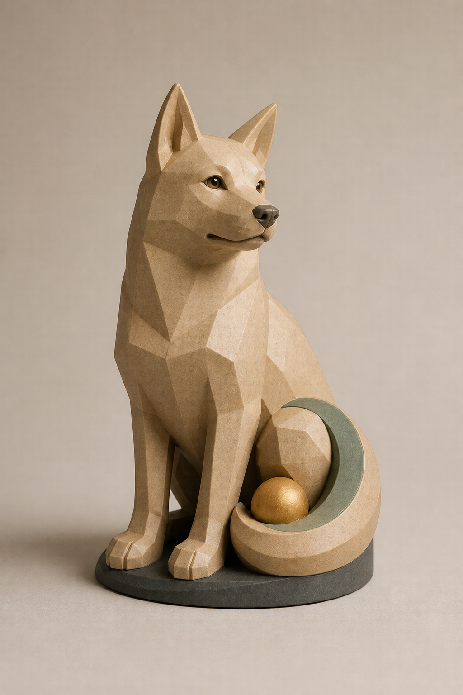

2. `Gate Guardian` — 약 22cm 현관 걸이용 얕은 부조

   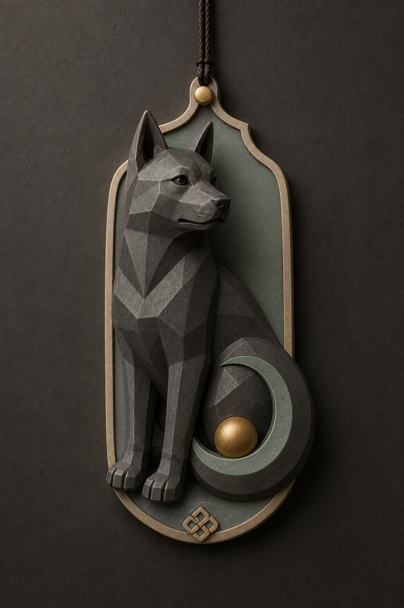

3. `Pocket Guardian` — 약 5.5cm 키링형 수호 참

   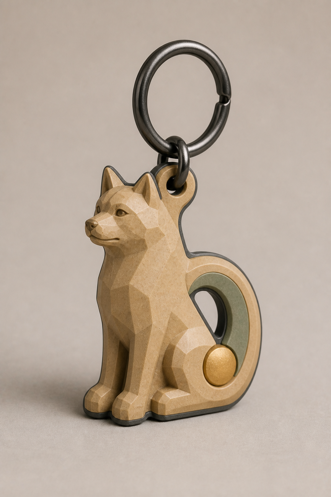

## 3. 아트월 메타 프롬프트

### v2 영물 추상화 잠금

```text
SPIRIT ABSTRACTION LOCK
The guardian is a supernatural presence, never a realistic animal portrait.
Preserve species readability with only three or four silhouette cues: ears,
muzzle, grounded chest, and one tail. Translate the rest of the body into the
selected medium and composition: terrain, mist, ink bleed, mineral field,
botanical ribbon, carved void, or geometric relief.

The art style must control anatomy, surface, space, and mood—not merely color.
Do not render realistic fur, photographic eyes, a wet nose, breed-specific
details, wildlife illustration, pet art, a cute mascot, or a fantasy-game
creature. The guardian should be discovered gradually but remain identifiable.
```

이 잠금은 `guardian_visibility`와 사실성을 분리한다. 가시성 65~80은 털과
얼굴을 사실적으로 그리라는 뜻이 아니라, 선택 화풍 안에서 종별 단서가 충분히
읽혀야 한다는 뜻이다.

세계 화풍 확장 규칙:

| 화풍 | 매체·구도 번역 | 정체성 이탈 방지 |
|---|---|---|
| 일본 민화·에도 목판 | 판각선, 평면 색면, 화선·바람·소나무·물결, 화지 섬유 | 여우·다중 꼬리·코마이누·시사 금지, 짧고 강한 개 주둥이 유지 |
| 유럽 중세 신화·상징주의 | 태피스트리, 템페라, 오래된 숲의 아치, 꼬리 미궁 | 케르베로스·지옥견·늑대 공격성·날개·게임 판타지 금지 |

두 화풍 모두 한국 풍수에서 결정된 Remedy Identity를 바꾸지 않는다. 문화권
화풍은 표면과 서사를 번역할 뿐 오행, 에너지 모드, 수호동물과 보호 고리는
고정한다.

우키요에 세부 라우팅:

| 변형 | 공간·에너지 표현 | 인쇄 특징 |
|---|---|---|
| 산수 대경관 | 빠른 접근 흐름이 산길과 물길을 따라 원형 웅덩이에 안정 | 판각선, 넓은 하늘, 보카시 하늘 |
| 아이즈리 야행 | 비·안개·문 속에 형상을 숨기고 하단 보호 원만 희미하게 강조 | 프러시안 인디고 중심, 저채도, 60% 암부·여백 |
| 스리모노 | 몸을 소나무·갈라진 흙·청자 구름·기하 파도로 접어 보호 인장화 | 가라즈리 압인, 운모, 무문자 여백, 절제된 금속 안료 |

### v1 메타 프롬프트

```text
Use case: stylized-concept
Asset type: premium vertical art-wall print for a personalized Korean Pungsu
hospitality product

Create {CONCEPT_NAME}. Translate the supplied Remedy Identity into one
museum-quality contemporary artwork. Earth is primary, Wood secondary;
STABILIZE first and CIRCULATE second. Show one clearly recognizable Korean
native guardian dog occupying 30–40% of the image. The dog is a calm,
benevolent Space Guardian, not a zodiac mascot. Its single tail closes into
a protective loop around a small warm orb. Show one arriving path or current
that bends and settles around the guardian.

Style: {STYLE_VARIANT}. Contemporary Korean-mystic fine art, mineral pigment
and subtle hanji texture, selective restrained brass contour. Stylish K-content
sensibility without costume-drama historicism.

Composition: portrait 2:3, full bleed, strong animal silhouette readable from
across a room, balanced negative space.

Palette: {PALETTE_VARIANT}; use warm sand, ochre, terracotta, muted celadon,
charcoal and only tiny brass accents.

Hard constraints: one anatomically coherent dog, four legs, one tail; no frame,
room mockup, typography, logo or watermark.

Avoid: dragon, tiger, kitsch zodiac illustration, cute mascot, generic fantasy,
anime, ornate palace motifs, excessive clouds, neon, aggressive expression,
copied artist style.
```

변형값:

| 콘셉트 | `STYLE_VARIANT` | `PALETTE_VARIANT` | 구도 잠금 |
|---|---|---|---|
| Quiet Gate | modernized minhwa linework + restrained organic abstraction | warm sand·ochre·terracotta·muted celadon·charcoal | 밝은 지형, 보호 원, 들어와 정착하는 길 |
| Celadon Night Watch | Korean lacquer painting + minimalist editorial abstraction | charcoal·ink black·muted celadon·dark umber·ochre | 큰 어두운 여백, 청자 흐름, 야간 보호 원 |
| Ochre Arrival | flattened mineral-pigment editorial poster | ochre·burnt terracotta·sand·celadon·charcoal | 비대칭 지형, 방패 고리, 대담한 도착 흐름 |

## 4. 오브제 메타 프롬프트

```text
Use case: product-mockup
Asset type: manufacturable collectible guardian object coordinated with the
Site art-wall collection

Create {OBJECT_NAME}, a hip contemporary Korean guardian-dog product based on
the supplied Remedy Identity. Preserve the recognizable seated dog, one thick
tail forming an integrated protective loop, and one captive ochre/brass orb.
Use refined low-poly architectural planes. It must feel sophisticated and
collectible, not cute or folkloric.

Format and scale: {FORMAT_AND_SCALE}
Construction: {CONSTRUCTION_RULES}

Materials and palette: matte warm sand or charcoal body, muted celadon inset,
charcoal edge or underside, tiny satin brass orb. Limit paint/material zones.

Presentation: one complete product, three-quarter or straight-on catalog view,
neutral premium studio lighting, full object visible, no packaging.

Manufacturing constraints: stable or reinforced connected silhouette, safe
rounded edges, no floating parts, fragile fur, whiskers or thin appendages;
support-minimized and plausible for FDM, resin printing or shallow-relief
production.

Hard constraints: one dog, one tail, no text, logo or watermark.
Avoid: dragon, tiger, fish shape, chibi mascot, ornate talisman replica,
tourist-shop souvenir, glossy cheap plastic, impossible undercuts.
```

변형값:

| 오브제 | `FORMAT_AND_SCALE` | `CONSTRUCTION_RULES` |
|---|---|---|
| Desk Guardian | 약 12cm 독립형 책상 조형 | 넓고 평평한 받침, 분리 가능한 구체, 지지대 최소화 |
| Gate Guardian | 약 22cm, 깊이 12–18mm 현관 얕은 부조 | 일체형 후면판, 보강 걸이 구멍 또는 키홀, 느슨한 장식 없음 |
| Pocket Guardian | 약 5.5cm, 두께 4–6mm 키링 참 | 4mm 이상 보강 연결공, 주머니에 걸리지 않는 모서리, 건메탈 링 |

## 5. 평가와 다음 제작 단계

- v2 현대 민화형은 기존 실물 액자의 흐름과 가장 자연스럽게 이어져 1차
  미니 액자 후속 테스트 후보로 적합하다.
- v2 추상형은 가장 인테리어 친화적이며 동물을 바로 드러내지 않는 선택지다.
- v2 수묵형은 여백이 커서 차분하지만 밝은 벽과 충분한 출력 농도가 필요하다.
- v2 기하 토템형은 현관 사인·오브제와 연결하기 가장 쉽고 인상이 강하다.
- v2 일본 민화형은 움직임과 패턴이 풍부해 복도·공용부의 시선 유도에 좋다.
- v2 유럽 신화형은 가장 서사적이고 고급스럽지만 어두운 공간에서는 출력
  암부와 얼굴의 늑대화 여부를 교정해야 한다.
- v1 아트월 3안은 사실적인 동물 초상 문제로 제작 후보에서 제외한다.
- Desk Guardian은 1차 3D 제작 후보로 가장 구조가 단순하고 상품성이 높다.
- Gate Guardian 렌더의 장식 외곽판은 실제 DFM에서 더 단순화해야 한다.
- Pocket Guardian은 귀·상단 연결공·꼬리 안쪽의 최소 두께를 CAD에서 검증한다.
- 생성 이미지는 제품 콘셉트 렌더이며 STL·CAD 원본이 아니다.
- 선택안이 정해지면 정면·측면·후면 턴어라운드 → 메시 생성 → CAD/메시 보정
  → 소형 출력 → 도색·걸이 내구 시험 순서로 진행한다.
