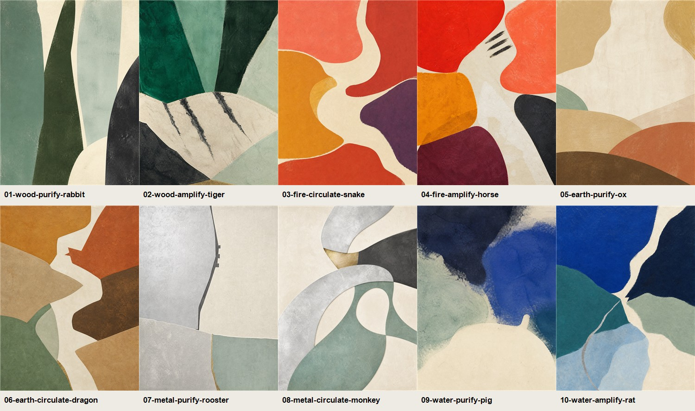
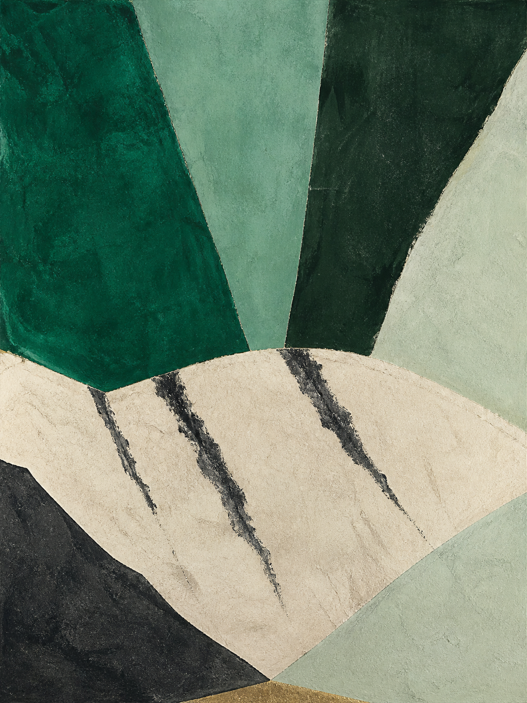
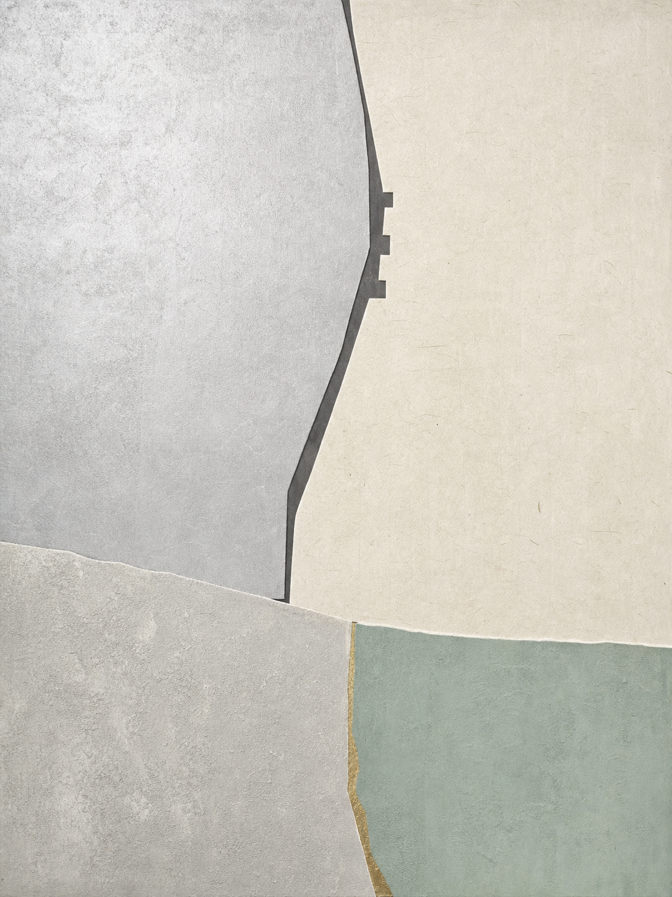
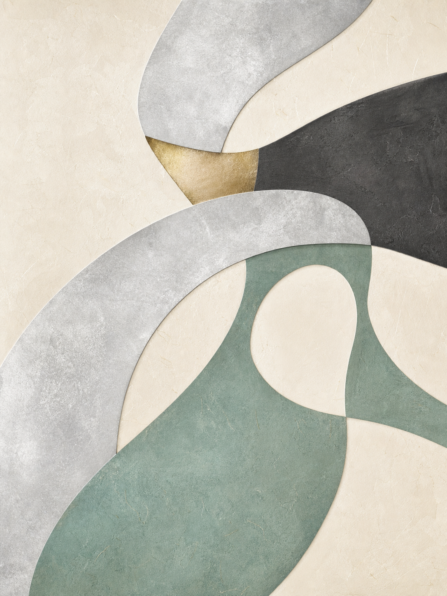

# 은호(隱護) 비방화 샘플 10종

> 제작일: 2026-07-26  
> 목적: 비방서의 오행 진단과 수호동물 선택이 실제 작품으로 어떻게 번역되는지 검증

## 먼저 읽을 것

아래 생년월일·진단·비방서는 이미지 생성 흐름을 시험하기 위해 만든 **가상 사례**다. 실제 명리 계산이나 개인 효능을 주장하지 않는다. 실서비스에서는 출생 시각·장소를 포함한 계산 결과와 사용자가 선택한 현실 목표를 입력으로 받아야 한다.

여기서 수호동물은 띠를 그대로 그리는 장식물이 아니다.

1. 부족하거나 과한 오행을 찾는다.
2. 정화(PURIFY)·순환(CIRCULATE)·증폭(AMPLIFY) 중 에너지 동작을 정한다.
3. 필요한 오행을 품은 동물 후보를 만든다.
4. 사용자의 띠와 충하는 후보, 공간과 정서에 맞지 않는 후보를 제외한다.
5. 선택된 동물의 실루엣이 아니라 귀·등선·꼬리·보폭 같은 **형태 문법만 10–20% 농도로 숨긴다.**
6. 동물 과노출, 사람 얼굴 오인, 로고화, 인테리어 부적합을 자동 검사한다.

## 10종 요약

| # | 가상 입력 | 비방 점수 / 동작 | 핵심 진단 | 은호 | 이미지 판정 |
|---|---|---|---|---|---|
| 01 | 1995-11-08 · 돼지띠 | 34 · 정화 | 수 과다, 목 부족 | 토끼 | 통과 — 가장 은은함 |
| 02 | 1990-06-21 · 말띠 | 82 · 증폭 | 금 과다, 목 부족 | 호랑이 | 통과 — 동물 인지가 빠름 |
| 03 | 1996-09-14 · 쥐띠 | 56 · 순환 | 수 과다, 화 부족 | 뱀 | 통과 — 흐름 중심 |
| 04 | 1991-08-03 · 양띠 | 78 · 증폭 | 토 과다, 화 부족 | 말 | 조건부 통과 — 표식 농도 높음 |
| 05 | 1989-05-27 · 뱀띠 | 29 · 정화 | 화 과다, 토 부족 | 소 | 통과 — 동물 농도 가장 낮음 |
| 06 | 1993-09-12 · 닭띠 | 63 · 순환 | 금 과다, 토 부족 | 용 | 통과 — 공간 흐름 우수 |
| 07 | 1988-10-04 · 용띠 | 38 · 정화 | 토 과다, 금 부족 | 닭 | 재생성 권장 — 얼굴 오인 가능 |
| 08 | 1984-07-11 · 쥐띠 | 61 · 순환 | 수 과다, 금 부족 | 원숭이 | 조건부 통과 — 동물 단서 약함 |
| 09 | 1999-04-23 · 토끼띠 | 31 · 정화 | 목 과다, 수 부족 | 돼지 | 조건부 통과 — 형상이 빨리 읽힘 |
| 10 | 1985-12-01 · 소띠 | 88 · 증폭 | 토 과다, 수 부족 | 쥐 | 통과 — 균형 가장 좋음 |

---

## 01. 청림유문 — 토끼

- **가상 의뢰:** 집중력 회복, 서재에 둘 작품
- **진단:** 수(水)의 체류가 길고 목(木)의 발아가 약한 상태
- **처방 동작:** 정화 — 막힌 기운을 걷어 낸 뒤 가는 상승축을 남긴다
- **은호 선택:** 토끼 — 목의 섬세한 생장성을 품고, 돼지띠와도 마찰이 적은 후보
- **조형 번역:** 옥빛 수직면, 좁은 빛길, 서로 다른 높이의 두 개 열린 틈을 귀의 문법으로 사용

**비방서**  
고인 물을 억지로 밀어내지 말고, 새순이 지나갈 한 줄의 길을 먼저 내어라. 청림의 틈에 숨은 토끼는 앞으로 뛰지 않는다. 다만 가장 조용한 방향을 먼저 알아보고, 마음이 따라올 때까지 그 길을 지킨다.

**자동 QC:** 통과. 첫눈에는 식물성 추상화이며, 두 번째 관찰에서만 토끼 귀의 리듬이 드러난다.

## 02. 백호개림 — 호랑이

- **가상 의뢰:** 새 사업의 추진력, 업무 공간
- **진단:** 금(金)의 절단성이 강하고 목(木)의 확장력이 부족
- **처방 동작:** 증폭 — 위로 솟는 목의 면적과 대비를 키운다
- **은호 선택:** 호랑이 — 목의 전진성과 말띠의 속도를 함께 받을 수 있는 후보
- **조형 번역:** 깊은 녹색 상승면, 활처럼 휜 밝은 등선, 세 개의 먹색 줄무늬

**비방서**  
베어 낸 자리마다 숲을 다시 세워라. 백호의 힘은 이빨이나 눈에 있지 않고, 한 번 정한 방향을 굽히지 않는 등에 있다. 세 줄의 흔적은 서두름이 아니라 시작·지속·완결의 박자다.

**자동 QC:** 통과. 호랑이 단서가 비교적 빨리 읽히므로 은호 농도의 상한선 사례로 사용한다.

## 03. 화류잠행 — 뱀

- **가상 의뢰:** 관계의 온도 회복, 거실
- **진단:** 수(水)가 감정을 붙잡고 화(火)의 표현이 약해진 상태
- **처방 동작:** 순환 — 열을 한곳에 모으지 않고 곡선 통로로 이동시킨다
- **은호 선택:** 뱀 — 화의 집중력을 품되, 쥐띠와 정면으로 충하는 말 후보는 제외
- **조형 번역:** 산호·주홍·황토 면 사이를 지나는 하나의 S자 빛길

**비방서**  
불을 크게 지피기보다 온기가 머물 길을 구부려 놓아라. 화류 사이의 흰 길은 말보다 먼저 방 안을 돈다. 보이지 않는 뱀은 열을 독점하지 않고 차가운 자리마다 작은 온도를 나눈다.

**자동 QC:** 통과. 뱀 자체보다 이동하는 기운이 먼저 보이며, 장식적 파충류 이미지로 흐르지 않는다.

## 04. 적운전진 — 말

- **가상 의뢰:** 인지도와 표현력 강화, 상업 공간
- **진단:** 토(土)가 움직임을 늦추고 화(火)의 외부 발산이 부족
- **처방 동작:** 증폭 — 전진 대각선과 고채도 화색 면을 확대
- **은호 선택:** 말 — 화의 외향성과 양띠의 화합 관계를 함께 반영
- **조형 번역:** 앞으로 밀고 나가는 밝은 사선, 세 갈래 갈기 표식, 주홍의 큰 압력면

**비방서**  
쌓인 흙 위에 길을 묻지 말고 먼저 한 걸음을 밝혀라. 적운 속 말은 몸을 드러내지 않고 목선과 갈기의 박자만 남긴다. 당신에게 필요한 것은 더 많은 준비가 아니라 이미 가진 열을 바깥으로 옮기는 순간이다.

**자동 QC:** 조건부 통과. 갈기 표식이 조금 명확해 상품화 시 10–15% 약화 권장.

## 05. 완토정좌 — 소

- **가상 의뢰:** 과열된 생활 리듬 완화, 침실
- **진단:** 화(火)가 빠르게 소모되고 토(土)의 수용력은 얇은 상태
- **처방 동작:** 정화 — 낮고 넓은 층으로 열을 가라앉힌다
- **은호 선택:** 소 — 토의 안정성과 뱀띠의 날카로운 속도를 받쳐 주는 후보
- **조형 번역:** 낮은 지층, 무거운 완만한 호, 뿔로 오인되지 않을 정도의 짧은 상승점

**비방서**  
오늘의 열을 내일까지 끌고 가지 말고 낮은 흙에 내려놓아라. 완토의 소는 서두르지 않으며, 무게를 버티는 방식으로 공간을 지킨다. 쉼은 멈춤이 아니라 흩어진 힘이 제자리로 돌아오는 일이다.

**자동 QC:** 통과. 최초 시안의 정면 동물·인체 실루엣을 폐기하고 비대칭 지층으로 재생성한 결과다.

## 06. 토맥유룡 — 용

- **가상 의뢰:** 가족 간 흐름과 환대, 현관
- **진단:** 금(金)의 경계가 강하고 토(土)의 연결 기능이 부족
- **처방 동작:** 순환 — 분리된 지층 사이에 하나의 굽은 통로를 만든다
- **은호 선택:** 용 — 토의 전환성과 닭띠와의 결속을 반영
- **조형 번역:** 황토 면을 잇는 흰 굴곡, 한 번 꺾인 머리마루, 길게 이어지는 몸의 궤적

**비방서**  
경계를 없애지 말고 서로 통하는 굽이를 하나 두어라. 땅속을 도는 용은 위세를 보이지 않는다. 단단히 나뉜 것들 사이에 작은 회전을 만들고, 닫힌 집의 기운을 안에서 밖으로 다시 잇는다.

**자동 QC:** 통과. 용 그림이 아니라 지맥의 흐름으로 인식되며 공간 작품성이 높다.

## 07. 은계절선 — 닭

- **가상 의뢰:** 판단력과 정리, 서재
- **진단:** 토(土)의 축적이 강하고 금(金)의 선별 기능이 둔화
- **처방 동작:** 정화 — 불필요한 면을 잘라 내고 얇은 절단선만 남긴다
- **은호 선택:** 닭 — 금의 분별성과 용띠와의 결속을 반영
- **조형 번역:** 은백색 절단면, 짧은 세 단계의 볏 리듬, 한 줄의 검은 경계

**비방서**  
더 채우기 전에 무엇을 남길지 먼저 정하라. 은계는 새벽을 만드는 것이 아니라 이미 온 새벽을 가장 먼저 구별한다. 세 번 꺾인 작은 선이 생각의 군더더기를 걷어 내고 결론이 설 자리를 만든다.

**자동 QC:** 재생성 권장. 오른쪽 절단선이 닭의 볏보다 사람의 코·입 옆선으로 오인될 가능성이 있다. 최종 파이프라인에는 **인간 얼굴 오인 검사**가 반드시 필요하다.

## 08. 환은유미 — 원숭이

- **가상 의뢰:** 계획을 실행 구조로 전환, 업무 공간
- **진단:** 수(水)의 아이디어는 많지만 금(金)의 구조화가 부족
- **처방 동작:** 순환 — 끊어진 고리를 연결하되 중심을 비워 둔다
- **은호 선택:** 원숭이 — 금의 기민한 구조성과 쥐띠의 협응 관계를 반영
- **조형 번역:** 은색 고리, 비대칭 회전, 말려 들어가는 꼬리의 궤적

**비방서**  
생각을 붙잡지 말고 돌아올 고리를 만들어라. 환은의 원숭이는 중심을 차지하지 않고 바깥을 돌며 흩어진 조각을 잇는다. 재치는 더 많은 선택이 아니라 서로 먼 두 점을 한 번에 연결하는 힘이다.

**자동 QC:** 조건부 통과. 추상 작품성은 좋지만 동물 단서가 너무 약해 꼬리 곡률을 5% 정도 강화할 수 있다.

## 09. 현수완복 — 돼지

- **가상 의뢰:** 정서적 회복과 숙면, 침실
- **진단:** 목(木)의 긴장이 지속되고 수(水)의 회복 여백이 부족
- **처방 동작:** 정화 — 날카로운 경계를 풀고 아래쪽에 넓은 휴식면을 둔다
- **은호 선택:** 돼지 — 수의 포용성과 토끼띠의 부드러운 결속을 반영
- **조형 번역:** 짙은 남색 수면, 둥근 상아색 저부, 아주 작은 위쪽 말림

**비방서**  
자라기만 한 가지를 잠시 물 아래 눕혀라. 현수의 돼지는 욕심의 상징이 아니라 충분히 쉬고 다시 채우는 배의 형상이다. 낮은 흰 면에 오늘의 긴장을 내려놓으면 밤의 물이 모서리부터 천천히 둥글게 만든다.

**자동 QC:** 조건부 통과. 둥근 몸과 꼬리가 다른 사례보다 빨리 읽혀, 상업 최종본에서는 말림을 줄이고 하단 면을 분할하는 편이 좋다.

## 10. 감천은미 — 쥐

- **가상 의뢰:** 기회 감지와 재물 흐름, 거실
- **진단:** 토(土)의 고정성이 강하고 수(水)의 탐색·이동성이 부족
- **처방 동작:** 증폭 — 깊은 청색 면과 밝은 유로의 대비를 키운다
- **은호 선택:** 쥐 — 수의 민감한 탐색성과 소띠의 결속을 반영
- **조형 번역:** 코발트 수면 사이의 가는 빛길, 한 점의 방향 전환, 은색 꼬리 궤적

**비방서**  
큰 문만 기다리지 말고 작은 틈에서 먼저 흐름을 읽어라. 감천의 쥐는 재물을 쌓아 두는 형상이 아니라, 아직 보이지 않는 통로를 감지하는 기민함이다. 푸른 면을 가르는 한 줄의 빛이 굳은 자리에서 움직일 첫 출구를 찾는다.

**자동 QC:** 통과. 오행색·에너지 동작·동물 단서의 균형이 10종 중 가장 안정적이다.

## 이번 테스트가 알려 준 것

- **가장 제품 방향에 가까운 시안:** 01 토끼, 03 뱀, 06 용, 10 쥐
- **강한 캐릭터가 필요한 옵션:** 02 호랑이, 04 말
- **은호 단서를 조금 보강할 시안:** 05 소, 08 원숭이
- **재생성 또는 약화가 필요한 시안:** 07 닭, 09 돼지
- 앞으로의 자동 QC에는 기존의 텍스트·프레임·로고·기형 검사 외에 `human_face_misread`, `animal_visibility`, `guardian_integration` 점수를 추가해야 한다.

실제 서비스에서는 사용자에게 화풍을 고르게 하지 않고, 비방서가 위 흐름을 자동 실행한다. 사용자가 선택할 수 있는 것은 필요할 경우 **동물 단서를 거의 숨김 / 은은하게 보임** 정도의 강도뿐이다.
