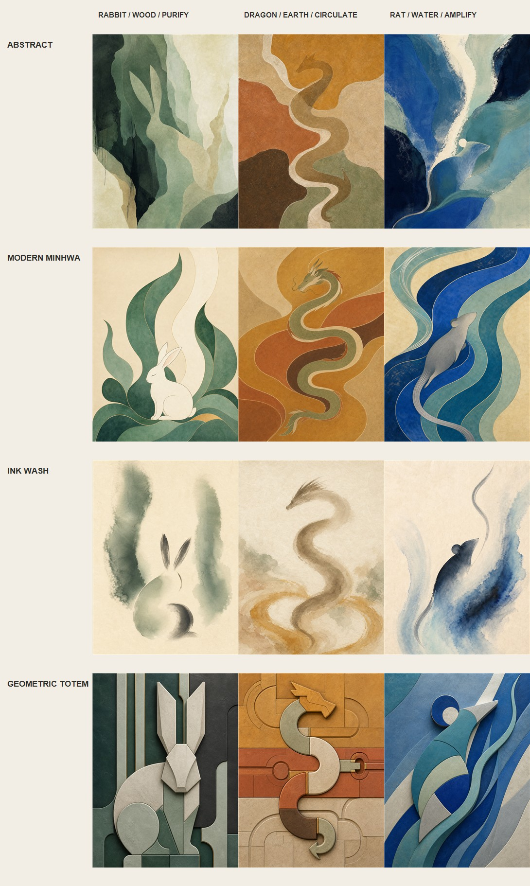
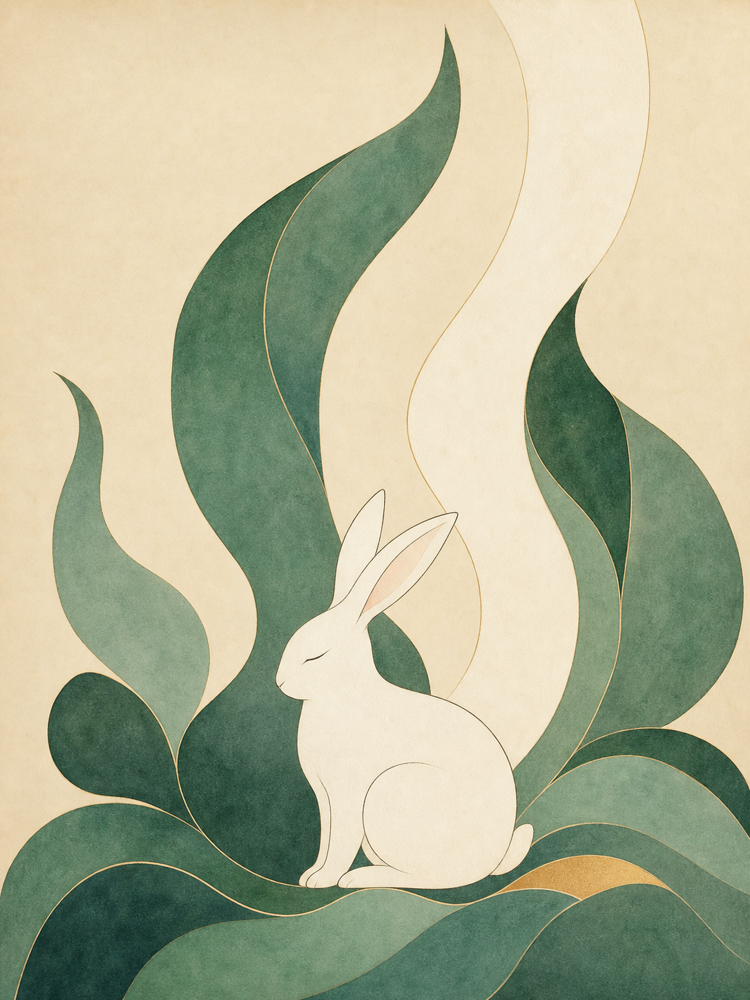
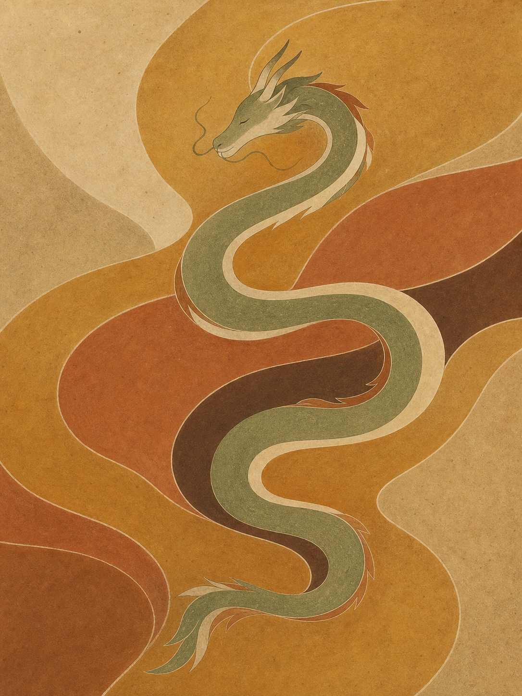
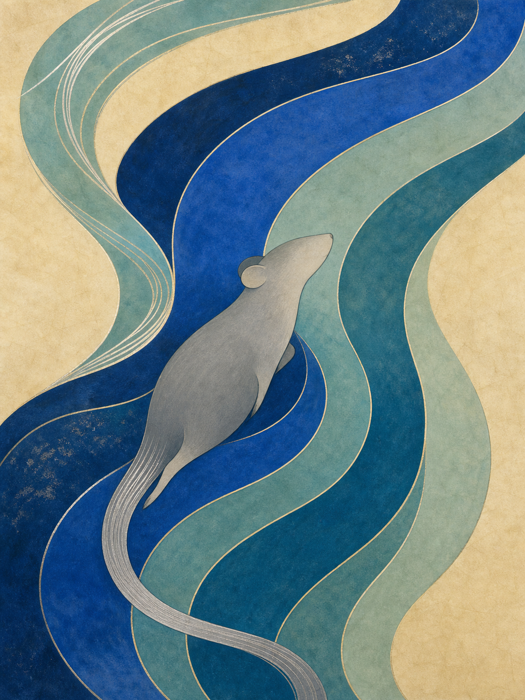
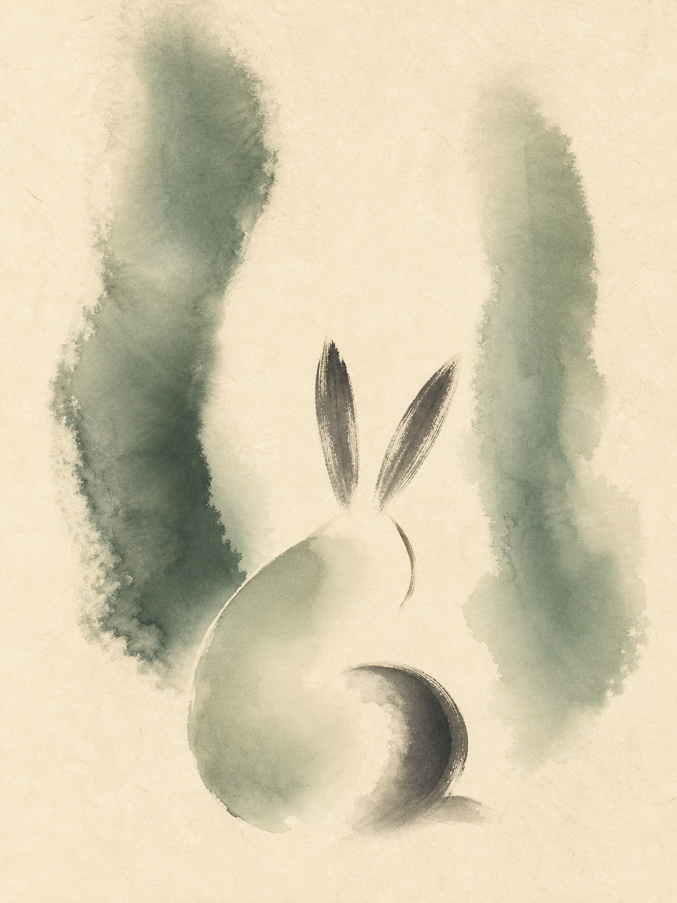
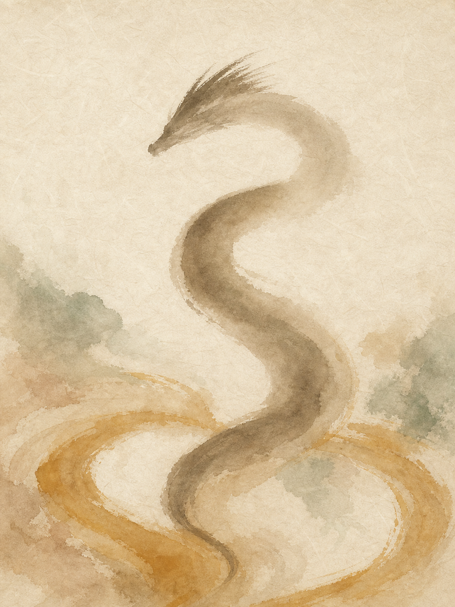
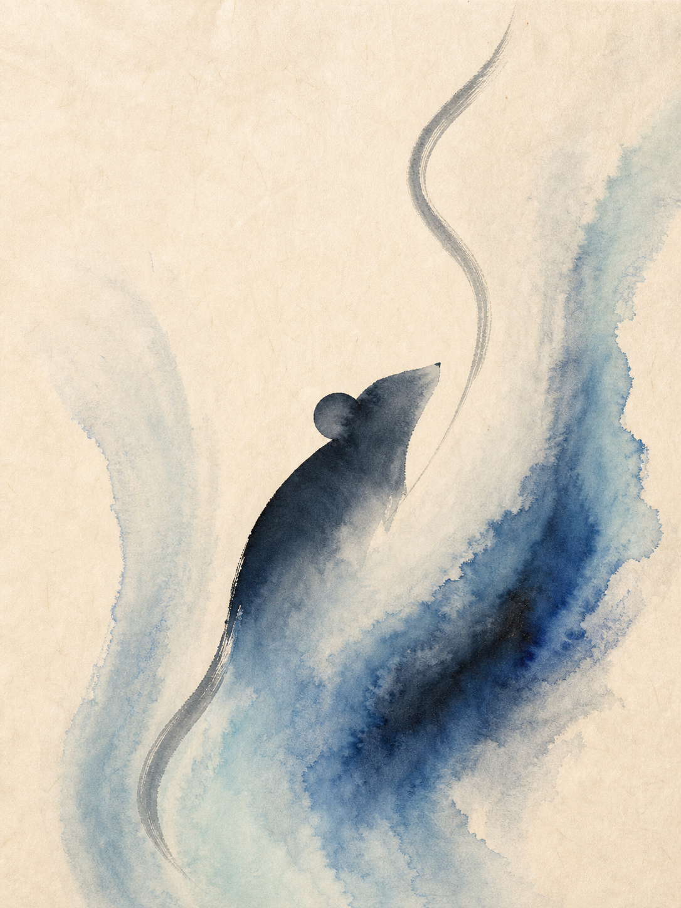
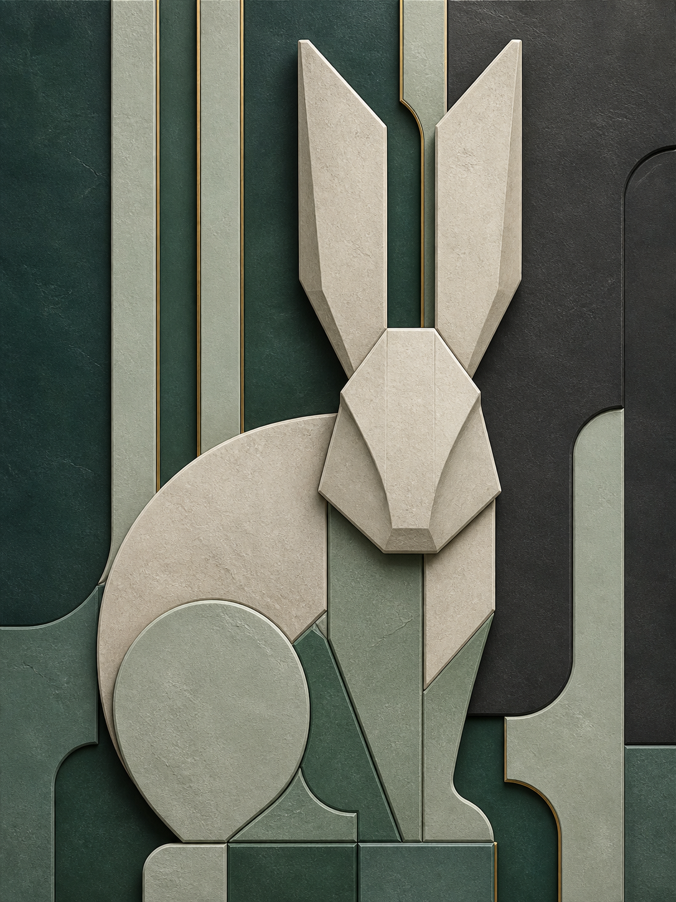
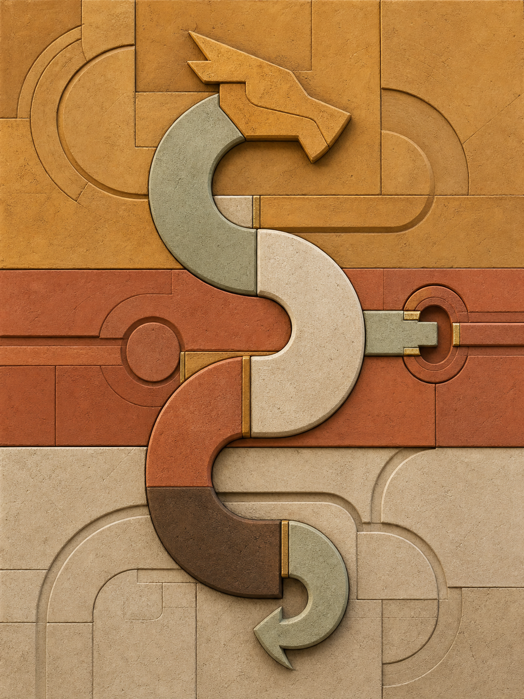
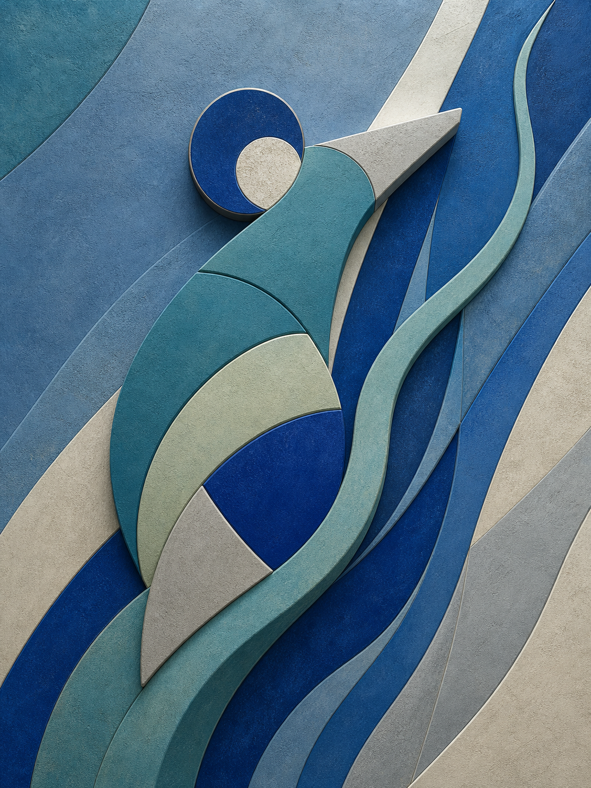

# 비방화 스타일 매트릭스 4 × 3

> 생성일: 2026-07-26  
> 비교 방법: 같은 비방서 3건을 네 가지 작품군으로 번역  
> 총 12장, 모두 3:4 세로형 원본 PNG



## 고정한 비방서 3건

| 열 | 은호 | 오행 진단 | 에너지 동작 | 핵심 조형 |
|---|---|---|---|---|
| 1 | 토끼 | 수 과다 · 목 부족 | PURIFY | 앉은 등선, 두 귀, 상승 통로 |
| 2 | 용 | 금 과다 · 토 부족 | CIRCULATE | S자 몸길, 머리마루, 회전 접점 |
| 3 | 쥐 | 토 과다 · 수 부족 | AMPLIFY | 솟는 등선, 연결된 귀, 긴 꼬리 |

## 1. 은호 추상화

| 토끼 | 용 | 쥐 |
|---|---|---|
|  |  |  |

- **강점:** 현대 인테리어 적합성과 개인 서사의 균형이 가장 좋다.
- **약점:** 동물을 모른 채 보면 종 구분이 늦을 수 있다.
- **추천 공간:** 거실, 서재, 일반 가정
- **자동 배정:** 순환형 기본값, 동물보다 오행 흐름이 중요한 비방

## 2. 현대 민화형

| 토끼 | 용 | 쥐 |
|---|---|---|
|  |  |  |

- **강점:** “나만의 수호동물”이라는 상품 서사가 즉시 전달된다. 선물성과 구매 전환 가능성이 가장 높다.
- **약점:** 동물 묘사가 강해지면 일반 띠 그림이나 캐릭터 상품으로 보일 위험이 있다.
- **추천 공간:** 거실 포인트월, 선물, 기념일 작품
- **자동 배정:** 강한 증폭, 관계·가족·성취 서사가 중요한 비방

## 3. 수묵 여백형

| 토끼 | 용 | 쥐 |
|---|---|---|
|  |  |  |

- **강점:** 감정적으로 가장 차분하고 비방의 정화·회복 서사와 잘 맞는다.
- **약점:** 종이와 인쇄 품질이 낮으면 작품이 비어 있거나 저렴해 보일 수 있다.
- **추천 공간:** 침실, 명상 공간, 조용한 서재
- **자동 배정:** 정화형, 휴식·회복·감정 안정 목적

## 4. 기하학적 토템형

| 토끼 | 용 | 쥐 |
|---|---|---|
|  |  |  |

- **강점:** 가장 현대적이고 강한 인상을 주며, 동일 구조를 3D 오브제로 전환하기 쉽다.
- **약점:** 지나치게 단순화하면 동물보다 로고·기계 부품·다른 동물로 오인될 수 있다.
- **추천 공간:** 업무실, 상업 공간, 로비, 3D 오브제 동시 구매
- **자동 배정:** 증폭형, 사업·추진·가시성 목적

## 1차 상품성 판단

1. **현대 민화형:** 고객이 상품의 개인화 가치를 가장 빨리 이해한다.
2. **은호 추상화:** 대중적인 인테리어 작품으로 가장 안전하다.
3. **수묵 여백형:** 프리미엄 용지와 결합하면 정화·회복 전용 상품군으로 강하다.
4. **기하 토템형:** 액자 단독보다 동일 형태의 3D 오브제와 세트로 판매할 때 가치가 커진다.

따라서 한 가지 화풍만 고정하기보다 비방서가 아래처럼 자동 라우팅하는 편이 적합하다.

```text
정화 + 침실/휴식     → 수묵 여백형 우선
정화 + 일반 거실     → 은호 추상화 우선
순환 + 가정/관계     → 은호 추상화 또는 현대 민화형
증폭 + 선물/개인서사 → 현대 민화형 우선
증폭 + 업무/상업     → 기하 토템형 우선
3D 오브제 동시 주문  → 기하 토템형 우선
```

## 다음 QC 보강점

- 민화형: `zodiac_merchandise_risk`, `cute_character_risk`
- 수묵형: `empty_or_unfinished_risk`, `low_contrast_print_risk`
- 토템형: `wrong_species_risk`, `logo_risk`, `3d_convertibility`
- 공통: `guardian_recognition`, `guardian_integration`, `human_face_misread`, `detached_feature_risk`

## 생성 방식

내장 이미지 생성 도구를 사용했다. 각 작품은 하나의 독립 프롬프트로 생성했으며, 공통 비방 변수는 고정하고 `STYLE_FAMILY`와 그에 따른 재료·가시성·금지 조건만 변경했다.
