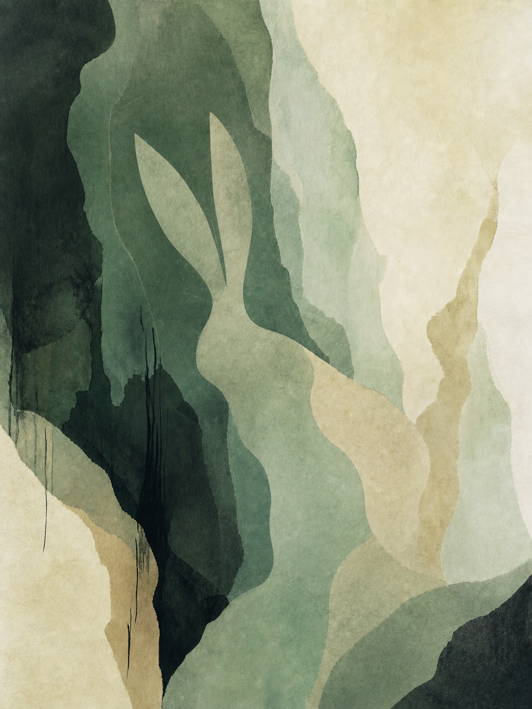
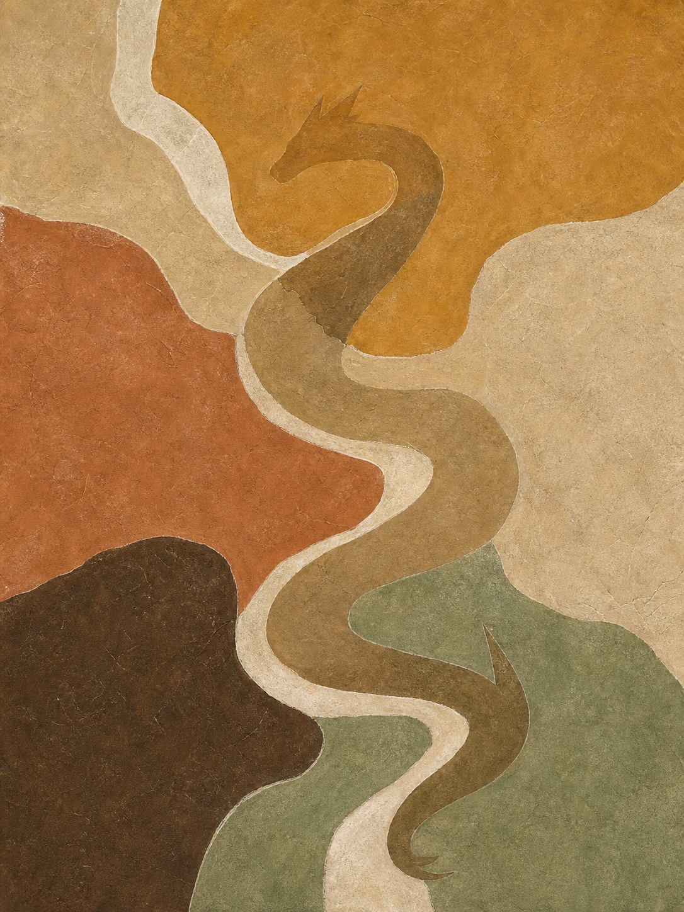

# 은호 가시성 v2 샘플 3종

> 기준: 작품 70% · 은호 30%, 약 3초 안에 동물 인지  
> 생성일: 2026-07-26

## 01. 청림유문 — 토끼 · 목 정화

- 가상 진단: 수 과다, 목 부족
- 동작: PURIFY
- 조형 단서: 두 귀, 앉은 등선, 접힌 뒷다리
- 보정 내용: 최초의 단색 동물 실루엣을 폐기하고 몸을 옥빛·청자빛·상아빛 세 색면으로 나눠 주변 추상면에 결합
- 판정: 동물 인지와 작품성의 중간값. v2 기본 농도 후보

## 02. 토맥유룡 — 용 · 토 순환

- 가상 진단: 금 과다, 토 부족
- 동작: CIRCULATE
- 조형 단서: 긴 S자 몸길, 짧은 머리마루, 갈고리 꼬리
- 판정: 세 작품 중 동물이 가장 분명하다. 순환 에너지와 동물의 자세가 한 구조로 결합했지만 상품화 시 머리마루를 약간 낮춰도 된다.

## 03. 감천은미 — 쥐 · 수 증폭

- 가상 진단: 토 과다, 수 부족
- 동작: AMPLIFY
- 조형 단서: 솟는 등선, 둥근 귀, 길게 이어지는 꼬리
- 판정: 세 작품 중 추상화와 동물의 결합이 가장 자연스럽다. 다만 귀가 독립된 원처럼 보이는 문제는 다음 프롬프트에서 몸선에 20% 겹치도록 보정한다.

## 비교 결론

- 기존 10종보다 동물 인지는 확실히 빨라졌다.
- 목표 농도는 토끼와 쥐 사이가 적합하다.
- 용은 강한 서사를 원하는 증폭형 작품의 상한값으로 사용할 수 있다.
- 다음 메타 프롬프트에는 `detached_feature_risk`를 추가해 귀·눈·꼬리가 독립된 기호처럼 뜨는 것을 방지한다.
