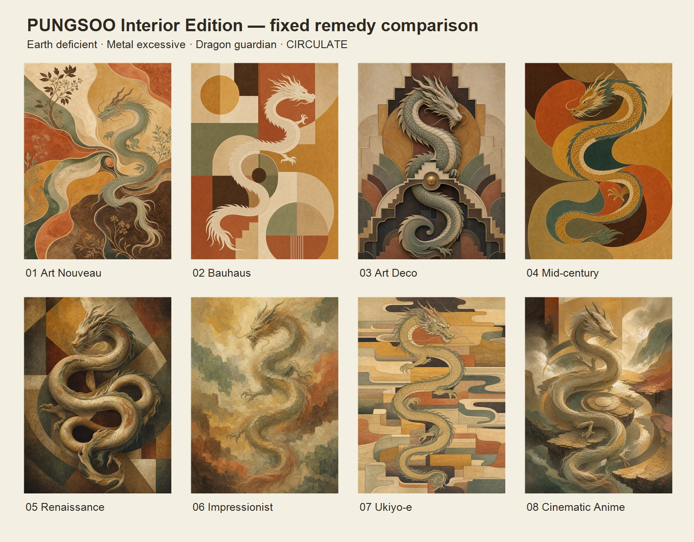

# Interior Edition 첫 8종 비교 샘플



## 고정 비방서

- 오행 상태: 토 부족, 금 과다
- 처방 목표: 토 기운 보강과 금 기운의 완충
- 수호동물: 용
- 에너지 동작: `CIRCULATE`
- 공통 구조: 하나의 용이 연결된 S자 흐름을 만들고, 분리된 색면 사이를 순환
- 공통 팔레트: 황토, 사암, 점토, 절제된 테라코타, 미네랄 세이지, 짙은 엄버
- 출력 형식: 세로 3:4, 작품 원본만, 텍스트·로고·액자·공간 목업 제외

화풍 차이만 보기 위해 위 처방 변수는 8장 모두 동일하게 유지했다.

## 생성 결과

| 번호 | 화풍 | 파일 | 1차 판정 |
|---|---|---|---|
| 01 | Art Nouveau | `01-art-nouveau-dragon-earth-circulate.png` | 식물 장식과 흐름이 자연스럽고 상품성이 높음 |
| 02 | Bauhaus | `02-bauhaus-dragon-earth-circulate.png` | 모던 공간 적합성이 높고 처방 색면이 명확함 |
| 03 | Art Deco | `03-art-deco-dragon-earth-circulate.png` | 액자·부조 오브제 세트로 확장하기 가장 좋음 |
| 04 | Mid-century | `04-midcentury-dragon-earth-circulate.png` | 대중적이고 인테리어 매칭이 쉬움 |
| 05 | Renaissance | `05-renaissance-dragon-earth-circulate.png` | 고급감은 있으나 판타지 생물화 위험을 더 제한해야 함 |
| 06 | Impressionist | `06-impressionist-dragon-earth-circulate.png` | 회화성과 수호동물 인식의 균형이 좋음 |
| 07 | Ukiyo-e | `07-ukiyoe-dragon-earth-circulate.png` | 선과 평면이 강해 K-풍수 컬렉션의 해외 판매 후보로 적합 |
| 08 | Cinematic Anime | `08-cinematic-anime-dragon-earth-circulate.png` | 시선을 끌지만 배경 서사성과 판타지 장면화를 더 줄여야 함 |

## 공통 메타 프롬프트 구조

```text
[용도와 출력 형식]
premium framed-art master, portrait 3:4, artwork only

[비방서의 불변 변수]
element imbalance + remedy goal + guardian animal + energy mode

[조형 번역]
element -> palette/material/weight
energy mode -> path/composition/motion
guardian -> one recognizable animal integrated into the energy path

[선택된 화풍 팩]
medium + line quality + value grouping + texture + depth + ornament density

[상품 제약]
adult interior art, printable, edge-to-edge, no room/frame/mockup/text/logo

[안전·독자성 제약]
no named artist/studio/franchise, no recognizable famous composition,
no extra animal, no duplicated guardian, no mascot or fantasy-game treatment
```

실제 생성에서는 화풍 팩만 교체하고 비방서의 불변 변수와 상품 제약은 유지한다. 특정 작가나 스튜디오 이름은 사용하지 않고 미술사조의 일반적 시각 문법만 기술한다.

## 다음 보정

- 르네상스: 배경을 서사 장면이 아닌 평면적 프레스코·태피스트리 구조로 제한
- 시네마틱 애니메이션: 산악·유적·모험 장면을 금지하고 추상 색면과 빛의 통로만 허용
- 전 화풍: 용의 다리 수, 꼬리 연속성, 신체 중복을 후처리 검수 항목으로 추가
- 인쇄 주문 전: A3 또는 12×16인치 기준 300 DPI 업스케일, 암부 뭉침, 재단 안전영역, 용지별 색역 교정

